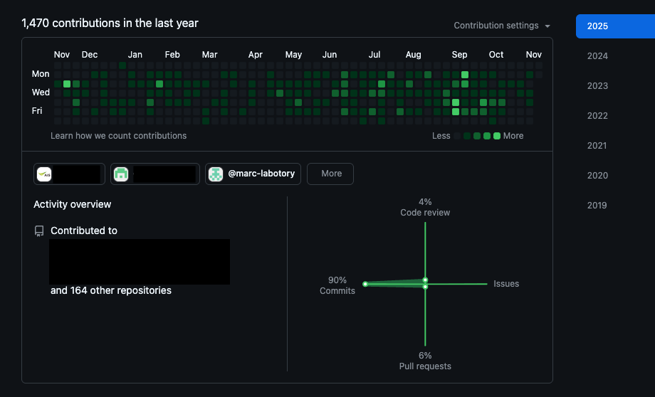

<h1 align="center">Hi, I'm Marc, Thanakrit Kwansang 👋</h1>

  

<h3 align="center">🔹Working currently at BBSEC Japan</h3>

---

### 🛠 DevOps Toolkit

  
  
  
  
  
  

---

### 🔥 About Me
- 🏗 Passionate about **Infrastructure as Code, CI/CD Pipelines, and Security Automation**
- 🚀 Automating deployments with **Kubernetes, Helm, and ArgoCD**
- 🔍 Performing **SAST, SCA, IaC, and DAST security scans** for secure applications
- 🧾 Strong awareness of Software Supply Chain Security and repository governance.
- 🔐 Familiar with compliance frameworks such as PCI DSS, HIPAA, NIST, and OWASP.
- 🎓 Certified in **Microsoft Azure AZ-900** // Have plan to get more cert soon
- 📝 Blogging about **DevOps, Cloud, and Security best practices**

---

### 📫 Connect with Me

  

